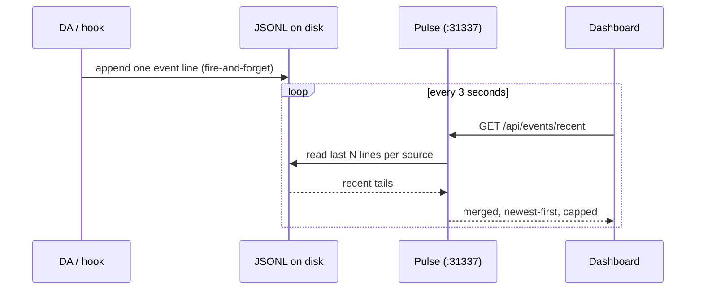

# The Observability System

> You can't steer a Life OS you can't see (`LIFEOS/DOCUMENTATION/LifeOs/LifeOsThesis.md`). Observability is the raw sensory feed behind the Life Dashboard — every tool call, agent, and failure as inspectable events, so both the principal and the DA can verify the hill-climb is actually climbing.

Single-source local event pipeline for LifeOS tool activity, voice events, subagent lifecycle, and tool failures. Pulse is the only consumer; it reads JSONL from local disk on demand.

> **Infrastructure:** The observability HTTP server (`localhost:31337`) runs as a module inside the unified Pulse daemon (`~/.claude/LIFEOS/PULSE/Observability/observability.ts`). There is no separate observability server process -- Pulse serves all local HTTP endpoints on port 31337.

## Architecture

```
JSONL Sources (local disk)
  ├─ tool-activity.jsonl (100)
  ├─ tool-failures.jsonl (50)
  ├─ voice-events.jsonl (50)
  └─ subagent-events.jsonl (50)
          │
          ▼
   Pulse (Observability/observability.ts)
   localhost:31337
   └─→ /api/events/recent  (read-on-demand from JSONL)
   └─→ /api/agents
   └─→ /api/observability/{tool-failures,voice-events,subagent-events,config-changes}
```

## Data Flow

1. **Emitters** — PostToolUse hooks write structured JSONL to `MEMORY/OBSERVABILITY/`
2. **Read-on-demand** — Pulse endpoints read the last N lines per source, merge, sort newest-first, cap at 200, and serve over HTTP
3. **Display** — The Observatory dashboard polls Pulse every 3s

## Event Sources

| Source | JSONL Path | Per-Source Count | Hook |
|--------|-----------|-----------------|------|
| Tool activity | `MEMORY/OBSERVABILITY/tool-activity.jsonl` | 100 | `EventLogger.hook.ts` (PostToolUse, catch-all) |
| Tool failures | `MEMORY/OBSERVABILITY/tool-failures.jsonl` | 50 | `EventLogger.hook.ts` (PostToolUseFailure) |
| Voice events | `MEMORY/VOICE/voice-events.jsonl` | 50 | Voice notification server |
| Subagent events | `MEMORY/OBSERVABILITY/subagent-events.jsonl` | 50 | `AgentInvocation.hook.ts` (PreToolUse:Agent / PostToolUse:Agent) |
| Agent watchdog | stdout (Monitor notifications) | — | `Tools/AgentWatchdog.ts` via Monitor tool. Reads tool-activity.jsonl + subagent-starts.json; alerts on 90s silence with active agents. Auto-triggered by Pulse agent-guard hook on background agent spawn. |
| Effort routing _(retired 2026-07-11)_ | `MEMORY/OBSERVABILITY/effort-router.jsonl` | — | `TheRouter.hook.ts` (retired/merged 2026-07-11) — mode/tier classification abolished, no successor writes this stream. The `MemoryReviewTrigger` MINIMAL-skip gate that read its tail is also gone. |
| ISA rework | `MEMORY/OBSERVABILITY/isa-rework.jsonl` | — | `ISASync.hook.ts` Resume-After-Complete path (Algorithm v6.9.0, 2026-05-22). One row per auto-rewind: ts, session_id, slug, prev_phase, new_phase, prev_iteration, new_iteration, body_delta_bytes. |
| Frame drift | `MEMORY/OBSERVABILITY/frame-drift.jsonl` | — | Algorithm VERIFY-phase emitter (v6.8.0). T1/T2/T3 boolean tests per ISA at VERIFY entry. |
| Reviewer runs | `MEMORY/OBSERVABILITY/reviewer-runs.jsonl` | — | `MemoryReviewer.ts` (autonomic memory). One row per reviewer execution: runId, transcript path, exchanges read, inference_duration_ms, parse_ok, dispatch_summary { total, by_type, succeeded, failed, failures }. |
| Reviewer fires | `MEMORY/OBSERVABILITY/reviewer-fires.jsonl` | — | `MemoryReviewFire.hook.ts` (Stop). Audit of when reviewer would fire if subprocess were unavailable. |
| Memory writes (Tier A) | `MEMORY/OBSERVABILITY/memory-writes.jsonl` | — | `MemoryWriter.ts`. One row per set-overwrite to `_MEMORY.md` hot-layer files. Tracks evictions. |
| Tier-B writes | `MEMORY/OBSERVABILITY/tier-b-writes.jsonl` | — | `MemorySystem.add()` routing. Audit row per logged-append to PROJECTS / CONTACTS / KNOWLEDGE / IDEAS (timestamp, type, bytes, path). |
| Pending proposals (Tier C queue) | `MEMORY/OBSERVABILITY/pending-proposals.jsonl` | — | `MemorySystem.add()` for `type:proposal`. Status lifecycle: pending → sent → accepted/rejected/edited/applied-elsewhere (or auto-applied without surfacing); `TERMINAL_STATUSES` in `LIFEOS/PULSE/lib/memory-proposals.ts` is the one authority on which of those count as resolved. Surfaced by that same lib on the Pulse dashboard and the inline 🧠 MEMORY line; decided via `bun LIFEOS/TOOLS/ProposalDecide.ts`. |
| Identity proposals (archive) | `MEMORY/OBSERVABILITY/identity-proposals.jsonl` | — | `LIFEOS/PULSE/lib/memory-proposals.ts` surfacer. Archive of sent/accepted/rejected/edited proposals. |
| Proposal replies | `MEMORY/OBSERVABILITY/proposal-replies.jsonl` | — | Pulse dashboard reply handler. Records accept/reject/edit interactions. |
| Memory retrievals | `MEMORY/OBSERVABILITY/memory-retrievals.jsonl` | — | `MemoryRetriever.getRelevantContext()` (ISC-107..112; not yet populated as of 2026-05-23; infrastructure ready). Per-turn BM25 audit. |

Per-source counts are configured inline in `Pulse/Observability/observability.ts`.

## Cortex evidence-driven health

The Cortex health extension is part of `LIFEOS/TOOLS/MemoryHealthCheck.ts`; `LIFEOS/TOOLS/CortexHealth.ts` collects and assesses its evidence. This is deliberately separate from `Cortex.ts status`: contract status reports local corpus shape, while health answers whether current reviewer, retrieval, proposal, observability, and optional-index evidence supports an operationally truthful result.

```bash
bun LIFEOS/TOOLS/MemoryHealthCheck.ts --json
```

The JSON report includes the effective `thresholds`, measured `evidence`, and non-OK `findings`. Existing health exit semantics remain 0/1/2 for ok/warn/critical. Missing evidence is WARN or CRITICAL, never green.

| Evidence | Source and rule | Default threshold | Severity |
|---|---|---:|---|
| Latest reviewer run | Latest terminal `reviewer-runs.jsonl` row, plus newer run directories | success within 7 days | stale/missing WARN; latest failed, parse-failed, malformed, invalid, or timed-out CRITICAL |
| Reviewer timeout | Newer run directory without terminal row | 10-minute grace | CRITICAL |
| Retrieval | Latest `memory-retrievals.jsonl` row | 24 hours | missing, malformed, future, or stale WARN |
| Proposals | Count rows with `status:"pending"` in `pending-proposals.jsonl` | greater than 10 | WARN; malformed evidence also WARN |
| Observability retention | Recursive `.jsonl`/`.log` bytes and oldest mtime under `MEMORY/OBSERVABILITY/` | 256 MiB or 30 days | WARN |
| Optional derived index | `lifeos-cortex-index/v1` manifest and measured hashes | 7-day freshness | stale WARN; invalid manifest or hash mismatch CRITICAL |

The latest reviewer evidence wins over any number of earlier successes. Any malformed reviewer JSONL line is surfaced as parse failure rather than skipped. A nominal success must include `ok:true`, `parse_ok:true`, a run ID, and a valid timestamp; future timestamps cannot prove freshness.

Index health distinguishes states that must not be conflated. The shipped `LIFEOS/CORTEX_INDEX_POLICY.json` is the affirmative `lifeos-cortex-index-policy/v1` marker for the healthy `no-index-v1` lexical baseline when no manifest exists. If both policy and manifest are missing, state is ambiguous and health warns `index-evidence-missing`; a malformed policy is CRITICAL. If a manifest exists, it supersedes the marker and health verifies its canonical SHA-256, derived-index SHA-256, contained relative index path, and `indexed_at`; canonical drift or index tampering is CRITICAL. No vector index currently exists.

Threshold overrides must be finite and positive or health emits critical `cortex-threshold-invalid`; `NaN` cannot disable a check. Operational overrides are `CORTEX_RETRIEVAL_STALE_MS`, `CORTEX_PROPOSAL_BACKLOG`, `CORTEX_OBSERVABILITY_MAX_BYTES`, and `CORTEX_OBSERVABILITY_MAX_AGE_MS`. The report preserves the actual threshold and source-path evidence used for each finding.

A read-only live check reports an overall verdict with per-check counts (critical/warn/ok) across reviewer freshness, index state, retrieval evidence, pending-proposal backlog against its threshold, and observability log age and size against their caps. Each run's report is point-in-time operational evidence, not a standing green claim.

This health path is local and file-backed. It adds no cloud telemetry, MCP endpoint, daemon, Chroma/CMEM process, or network service. Full contract and privacy boundaries: [`../Memory/CortexContract.md`](../Memory/CortexContract.md).

## Event Format

All events conform to the `LifeosEvent` interface:

```typescript
interface LifeosEvent {
  timestamp: string;     // ISO-8601 with timezone
  session_id: string;    // Claude Code session ID
  source: string;        // "tool-activity" | "tool-failure" | "voice" | "subagent"
  type: string;          // Event type (e.g. "tool_use", "voice_start", "subagent_start")
  [key: string]: unknown; // Additional fields per source
}
```

## Read Timing

Pulse reads on demand. The Observatory dashboard polls `/api/events/recent` every 3s; each request reads JSONL tails from disk (no persistent in-memory cache; Bun fs is fast enough at 50-100 lines per source).

## Key Files

| File | Role |
|------|------|
| `~/.claude/hooks/EventLogger.hook.ts` | Consolidated event writer (absorbed ToolActivityTracker + ToolFailureTracker + SkillExecutionLog + ConfigAudit + StopFailureHandler 2026-07-11). PostToolUse catch-all → tool-activity.jsonl (+ SKILLS/execution.jsonl on Skill); PostToolUseFailure → tool-failures.jsonl; ConfigChange → config-changes.jsonl; StopFailure → SECURITY stop-failures (log-only) |
| `~/.claude/LIFEOS/PULSE/Observability/observability.ts` | Observability module inside unified Pulse daemon — serves events from JSONL at :31337 |
| `~/.claude/LIFEOS/PULSE/Observability/` | Next.js static dashboard — polls `/api/events/recent` |

## Dashboard Locations

| Destination | URL | Data Source |
|-------------|-----|-------------|
| LifeOS Observatory | `localhost:31337/` → Actions tab | Local JSONL via Pulse `Observability/observability.ts` |

## Observatory Dashboard

The LifeOS Observatory is the local observability UI -- a Next.js 15.5 static export served by Pulse on `localhost:31337`.

### Project Layout

| Item | Value |
|------|-------|
| Source | `~/.claude/LIFEOS/PULSE/Observability/` |
| Build command | `cd ~/.claude/LIFEOS/PULSE/Observability && bun run build` (outputs to `out/`) |
| Serving mechanism | Direct: `~/.claude/LIFEOS/PULSE/Observability/out` (configured in PULSE.toml `dashboard_dir`) |
| URL | `http://localhost:31337/` (served by Pulse observability module) |
| Process management | Pulse runs under launchd (`com.lifeos.pulse`) with auto-restart. **Always** use `launchctl stop/start com.lifeos.pulse` -- never `kill`. |

### Dashboard Pages

| Page | URL | Purpose |
|------|-----|---------|
| Agents | `/agents` (default) | Work dashboard -- iterations, optimize, ideate, loops |
| Knowledge | `/knowledge` | Knowledge archive browser |
| Security | `/security` | Security system management -- patterns, rules, events, hooks. **Private install only — containment-zoned, not in the public payload.** |

### Security Page (`/security`)

> **Not in the public release payload.** The security page's implementation is containment-zoned; this section documents the concept and the endpoint contract, not a route a fresh install serves.

The security page provides full management of the LifeOS security system through four tabs:

| Tab | Function |
|-----|----------|
| **Model** | The current three-layer model — constitutional rule + `settings.json` `permissions.deny` + `Safety.hook.ts` (the PATTERNS.yaml/SECURITY_RULES.md editor was retired 2026-05-06) |
| **Deny List** | The native `permissions.deny` entries; edit in `settings.json` directly |
| **Events** | Recent security events from `MEMORY/SECURITY/YYYY/MM/` |
| **Hooks** | Hook health status with expandable descriptions |

Additional features:

- **Architecture visual** -- Inspector pipeline flow diagram displayed at top of page
- **Injection defense** -- Shows the `Safety.hook.ts` PostToolUse "treat as data" tagging of WebFetch/WebSearch content and its injection-shape markers
- **Live editing** -- All changes write directly to disk and take effect on next tool call

### API Reference (all served by Pulse on `localhost:31337`)

All endpoints served by the Pulse daemon's observability module (`Observability/observability.ts`) unless noted.

**Core Observability**

| Endpoint | Method | Purpose | Source |
|----------|--------|---------|--------|
| `/health` | GET | Pulse daemon health check | `pulse.ts` |
| `/api/observability/state` | GET | Current session state (ISA, phase, progress) | observability |
| `/api/observability/state` | POST | Push session state from hooks | observability |
| `/api/observability/events` | GET | Raw event data | observability |
| `/api/observability/events` | POST | Push events from hooks | observability |
| `/api/events/recent` | GET | Merged recent events across all sources | observability |
| `/api/observability/voice-events` | GET | Voice event log | observability |
| `/api/observability/tool-failures` | GET | Tool failure log | observability |

**Algorithm & Sessions**

| Endpoint | Method | Purpose | Source |
|----------|--------|---------|--------|
| `/api/algorithm` | GET | Work sessions — ISA metadata, ISC progress, phase history | observability |
| `/api/agents` | GET | Subagent events — start/stop/duration from JSONL | observability |
| `/api/novelty` | GET | Ideate-run telemetry (UI removed 2026-07-08, archived as future work) | observability |
| `/api/ladder` | GET | Improvement pipeline data (UI removed 2026-07-08, archived as future work) | observability |

**Security**

| Endpoint | Method | Purpose | Source |
|----------|--------|---------|--------|
| `/api/security` | GET | Combined current model: the three security layers (constitutional rule + `permissions.deny` + `Safety.hook.ts`), native deny list, and hook detail | observability |
| `/api/security/hooks-detail` | GET | Hook descriptions, events, blocking capability | observability |
| `/api/security/attack-surface` | GET | Deployed-estate scan snapshot (404 when no scanner is configured on the install) | observability |
| `/api/security/patterns`, `/api/security/rules` | POST | **Retired — HTTP 410 Gone.** PATTERNS.yaml/SECURITY_RULES.md were removed in the 2026-05-06 security simplification; edit `settings.json` `permissions.deny` directly | observability |

**Knowledge**

| Endpoint | Method | Purpose | Source |
|----------|--------|---------|--------|
| `/api/knowledge` | GET | Knowledge archive — domains, notes, MOC data | observability |
| `/api/knowledge/:domain/:slug` | GET | Individual knowledge note content | observability |
| `/api/knowledge/:domain/:slug` | PUT | Update knowledge note | observability |

**Wiki (LifeOS system docs + knowledge browser)**

| Endpoint | Method | Purpose | Source |
|----------|--------|---------|--------|
| `/api/wiki` | GET | System doc index | `modules/wiki.ts` |
| `/api/wiki/search` | GET | Full-text search across system docs | `modules/wiki.ts` |
| `/api/wiki/graph` | GET | Knowledge graph data for visualization | `modules/wiki.ts` |

**DA (Digital Assistant)** — *`Assistant/module.ts` is containment-zoned and does not ship in the public payload; these rows document the endpoint contract, not routes a fresh install serves.*

| Endpoint | Method | Purpose | Source |
|----------|--------|---------|--------|
| `/assistant/health` | GET | DA subsystem health | `Assistant/module.ts` |
| `/assistant/identity` | GET | Current DA identity summary | `Assistant/module.ts` |
| `/assistant/personality` | GET | DA personality traits | `Assistant/module.ts` |
| `/assistant/personality/traits` | PATCH | Update personality traits | `Assistant/module.ts` |
| `/assistant/avatar` | GET | DA avatar image | `Assistant/module.ts` |
| `/assistant/tasks` | GET | Unified task view (DA + Pulse cron + CC triggers) | `Assistant/module.ts` |
| `/assistant/tasks` | POST | Create DA scheduled task | `Assistant/module.ts` |
| `/assistant/tasks/:id` | DELETE | Cancel DA task | `Assistant/module.ts` |
| `/assistant/diary` | GET | Recent diary entries | `Assistant/module.ts` |
| `/assistant/opinions` | GET | Current DA opinions | `Assistant/module.ts` |

**Voice & Notifications**

| Endpoint | Method | Purpose | Source |
|----------|--------|---------|--------|
| `/notify` | POST | Send TTS notification via ElevenLabs | `pulse.ts` |
| `/notify/personality` | POST | Personality-aware notification | `pulse.ts` |
| `/voice` | GET | Voice status | `pulse.ts` |

**Hook Validation**

| Endpoint | Method | Purpose | Source |
|----------|--------|---------|--------|
| `/hooks/skill-guard` | POST | Validate Skill tool calls (PreToolUse HTTP hook) | `modules/hooks.ts` |
| `/hooks/agent-guard` | POST | Validate Agent tool calls (PreToolUse HTTP hook) | `modules/hooks.ts` |

**Removed stubs** — the `/api/loops*` stub routes were deleted 2026-07-14 with the agents-dashboard redesign (Loop mode retired 2026-07-11; the stubs only ever returned `[]` / `not_available`).

### Deployment Checklist

1. Edit source in `~/.claude/LIFEOS/PULSE/Observability/src/`
2. Build: `cd ~/.claude/LIFEOS/PULSE/Observability && bun run build`
3. Restart Pulse: `launchctl stop com.lifeos.pulse && launchctl start com.lifeos.pulse`
4. Hard refresh browser: Cmd+Shift+R

## Session State Tracking

Distinct from the event pipeline above, session state (active sessions, phase, progress, criteria, ratings) flows through a single canonical file. Both the Pulse dashboard and any external admin dashboard's agents page read the same file so they never drift.

**Canonical source:** `$LIFEOS_DIR/MEMORY/STATE/work.json`

```
Writers (atomic read-modify-write via isa-utils.ts:writeRegistry)
├─ SessionAnalysis.hook.ts      RETIRED — file no longer exists; upsertSession is unowned
├─ EventLogger.hook.ts          PostToolUse → bumpLastToolActivity (30s debounced)
├─ ISASync.hook.ts              syncToWorkJson() → promote native entry to full ISA session
└─ ISAAutoName.hook.ts          RETIRED — file no longer exists

Readers (both use identical mapping)
├─ Pulse Observability          localhost:31337 → observability.ts handleAlgorithmApi
└─ external admin daemon        localhost:4000  → server/src/algorithm-watcher.ts
```

**Display lanes:**
- Mode `starting` → Algorithm tab, phase strip (states derived from the one table in `LIFEOS/TOOLS/ascent.ts`).
- Mode `native` → Native tab, no phase strip.

**Classifier (historical — `SessionAnalysis.hook.ts` is retired and no longer ships):** its action regex (the `ALGO_ACTION_RE` symbol was deleted 2026-07-11 with the mode/tier system) — narrow 8-verb regex (`implement|build|create|architect|design|migrate|deploy|refactor`). Everything else that passes the trivia filter (`POSITIVE_PRAISE_WORDS`, `SYSTEM_TEXT_PATTERNS`, `MIN_PROMPT_LENGTH=3`) is native. Do not broaden — see `feedback_state_monitoring_requires_starting_gate.md`.

**Staleness thresholds:** 5 min native, 10 min algorithm. Matched in both readers.

**Loud-fail:** `algorithm-watcher.ts` emits `console.error` on missing work.json at startup; `/api/algorithm` returns HTTP 503 with the resolved path. `EventLogger.hook.ts` logs exceptions via `console.error` so a silently-broken tracker shows up in session logs.

**Self-healing:** Both readers use `Math.max(updatedAt, lastToolActivity)` for the activity signal, so a fresh user prompt revives a stale session even if the tool-activity tracker is down.

## Examples

### One tool call, from disk to dashboard

Watch a single tool call travel the pipeline:

1. The DA runs a command. The moment it returns, the PostToolUse `EventLogger` hook appends one JSON line to `tool-activity.jsonl` — synchronous, fire-and-forget, no network.
2. Nothing is pushed anywhere. The line just sits on disk.
3. The Observatory dashboard, open in a browser, polls `/api/events/recent` every three seconds. On the next poll, Pulse reads the tail of each JSONL source, merges them newest-first, and serves the batch.
4. The call shows up in the activity feed, roughly three seconds after it happened.

The whole design is **read-on-demand**: emitters only ever append to local files, and the one consumer (Pulse) pulls tails when the dashboard asks. There's no event bus, no in-memory queue, no push — a crashed dashboard loses nothing, because the events were never in flight.

### A failure takes a parallel path

The same shape handles the unhappy case. A tool errors, so the `PostToolUseFailure` branch of the same hook appends to `tool-failures.jsonl` instead — tool name, error, truncated input, timestamp. It surfaces in the dashboard's failures panel on the next poll, without ever touching the activity stream. One writer, several typed sinks, one puller.

### The pipeline in one picture



The gap between "it happened" and "you can see it" is one poll interval, and the only moving part is a file append. Nothing buffers state that a restart could drop.

---

## See Also

- `~/.claude/LIFEOS/DOCUMENTATION/Memory/CortexContract.md` — Cortex CLI contract, privacy limit, benchmark, and health evidence
- `~/.claude/LIFEOS/DOCUMENTATION/LifeosSystemArchitecture.md` — Master LifeOS architecture reference
