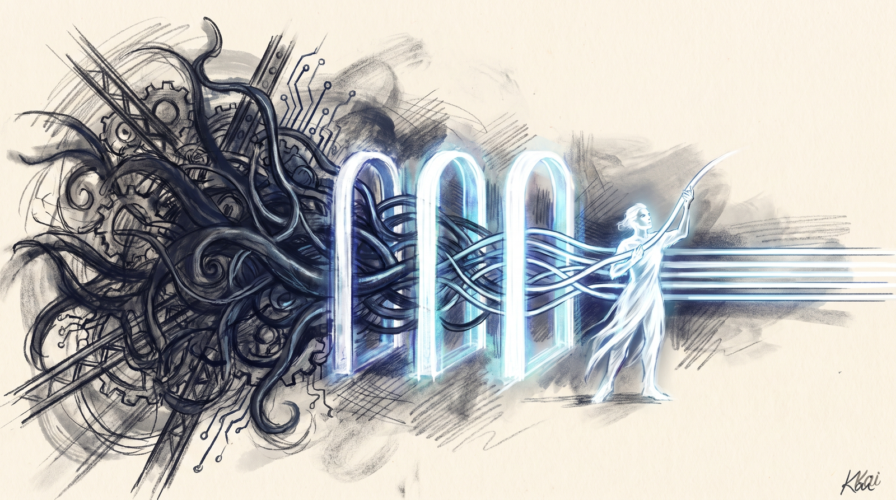

# LifeOS 7.40.4 — The Receipts Release

**Thirteen days, 61 substantive changes, 30 community fixes, and one theme: the system now proves what it claims.**

The oldest complaint about AI systems, this one included, is that they say "done" when they aren't. A run reports success and the test never ran. A dashboard glows green over data that doesn't exist. An installer corrupts the thing it installs and exits zero. Since 7.28.3, most of what we shipped attacks that gap from a different angle, and the community found more of it than we did. This release is where a lot of that work lands at once.

## The Algorithm: the hill-climb you can see, and can't fake

The Algorithm went from 8.17.3 to 8.20.2, and the thread through every change is honesty about where a run actually is.

- The phase strip. Long runs now show their climb in the response itself, and the strip is computed by a hook from the run's real state; the model just echoes it. This exists because we caught a run claiming it was ascending while the board derived from the same data said it was still traversing. The model can no longer say one thing while the state says another; both read from one source.
- Euphoric surprise is now the meta-ideal-state of every ISA. Each ISA names the specific ideal state of one piece of work. Above every one sits the same universal goal: the person using the system gets exactly what they wanted, at the right speed, for the right spend. The doctrine now says this out loud, and the specific climb and the general one are one motion.
- Delegate briefs sized by blast radius. When the Algorithm hands work to a subagent, the brief's depth now scales with what the work can break, so trivial legs stop carrying ceremony and dangerous legs stop going out underspecified.
- ISA verifier classes and execution tiers. Claims now declare what kind of evidence closes them, and the machinery routes each claim to a verifier that can actually produce that evidence. "Should work" was already banned; the ban now has enforcement machinery behind it.

## Everything ships with receipts: the release pipeline grew teeth

Users kept finding things in the public payload that our gates missed: dead template tokens, files that reference machinery that never ships, a maintainer's runtime state where a template belonged. Every one of those reports became a permanent, deterministic gate. The cut pipeline now runs 23 build gates plus a set of emit gates, and this cycle alone added checks for unrendered placeholders in live code, references to per-instance state files that never ship, retired capabilities still described as live, incident identifiers in shipped prose, hardcoded voice IDs in templates, and maintainer-only instructions presented to fresh installs as things they can run.

On top of the gates, every cut now ends with two independent read-only audits: a cross-vendor model reviewing the payload from outside our model family, and a fresh-context in-family pass attacking with insider knowledge. Findings from either block the release. The rule that makes this compound: every finding must also become a deterministic catch, so the same class can never need an audit again.

## The community wave: 30 fixes from the people running this thing

Two triage rounds in this span ported 30 community contributions, and the reports were unusually good: reproduction tables, traced root causes, proposed diffs that survived review nearly unchanged.

Highlights, with the people who found them:

- Install no longer corrupts its own payload. The identity-substitution pass walked into the redistribution copy and baked one user's name into ~121 template files. Found by @Piroshki, root-caused by @DRAZY, fixed at the walk. Related: file modes now survive substitution, so hooks stop silently losing their execute bit (@alloutflo, @mark-219).
- Session names stop being word salad. The last-resort naming strategy planted a verb that let any four words pass validation, which turned non-English prompts into nonsense titles. Deleted; an unnamed session now just retries. Task verbs like "complete" and "finish" are also no longer banned from leading a name (@xmasyx).
- Voice lines survive a misnamed DA. If your assistant's configured name didn't match what it wrote, the system silently spoke a CHANGE bullet instead of the closer, for days. Extraction is now anchored to your configured name first with a safe fallback, and the fallback logs itself (@MatiasBarboza).
- Dashboards read the data that's actually there. The life hero rendered "Unknown, Unknown energy" while populated data sat one parser away; the check-in invented two of its three numbers; ISA progress mismatches were detected and then logged to nowhere. All fixed (@jacobo-ortiz, who filed seven forensic reports in one day).
- Forked subagents are now detected (@DRAZY), the proposal parser stops eating ordinary messages that start with "no" (@xmasyx), iMessage sending works on current macOS (@J0UH), the memory reviewer can no longer resolve a conflict it cannot source and stamp it as your stated fact (@Chuckos), and the DA identity template ships the schema its own docs define (@justinkatz94-glitch).

## Pulse: a dashboard that ships working

The Pulse dashboard's static export is now actually in the release. Every prior release silently dropped it: 181 files swallowed by a gitignore rule, so fresh installs got a dashboard they had to build themselves. Now `localhost:31337` works out of the box. Alongside it: scheduled jobs never voice-notify anymore (your cron jobs stop talking at 3am), a new guard blocks headless sessions from reaching the speaker at all, and the statusline gained a privacy overlay for security-engagement work.

## Cortex, and the rest of the new machinery

- Cortex consolidation. The memory system's skills merged into one, with a weekly Distill pass that compresses accumulated knowledge before it silts up.
- Helm ships self-contained. The LifeOS terminal (kitty config layer, installer, app wrapper) now lives inside the release, with its installer hardened through three rounds of destructive-edge review.
- New skills: Novelty (evolutionary explanation-discovery for hard problems), SecurityMarketData (curated cybersecurity market intelligence), Vitals (macOS performance diagnostics), Share (self-hosted file sharing), and DetectAI grew deterministic statistical signals plus keyless watermark and steganography scanning.
- Hermes gained a zero-token heartbeat: calendar, mail, and queue ticks every ten minutes as pre-run scripts, so the sidecar stays current without burning a single model call.
- Vulnerability management now cross-references CISA KEV with a page-now override, and a new advisory ComplexityRatchet meter flags complexity drift on every edit without ever blocking one.
- Bunker joined the core component roster: the universal application harness's concept docs ship, with the reference implementation staying private by design.

## For the people who asked "should I upgrade?"

A few discussion threads this cycle asked whether 7.x is worth it from 4.x or 5.x, and one user's DA even flagged our own installer as suspicious before recommending against upgrading. Fair. The honest answer is that this line of releases is specifically about making the system prove itself: commit-pinned downloads with printed checksums, an installer that backs up before it touches anything and restores itself if interrupted, gates that block us from shipping our own private data, and a dashboard that works on first boot. That is also why these notes walk through the work in detail: the receipts are the point.

---

*Every contributor named above is also credited at the fix site in source and in the README. If you filed something that isn't here, it's tracked, and the next release's notes will say where it landed.*
